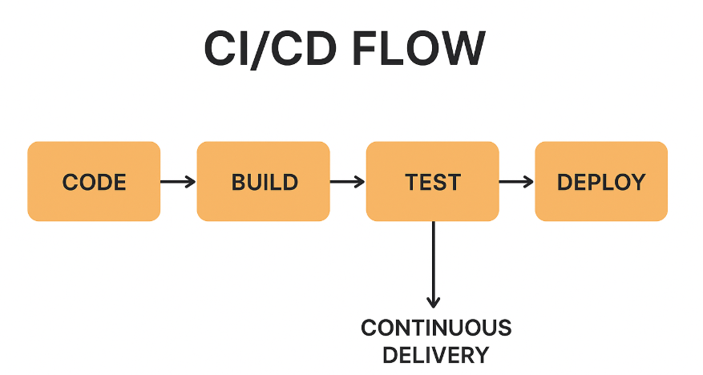

🚀 CI/CD – Continuous Integration & Continuous Delivery/Deployment

📌 What is CI/CD?

CI/CD is a set of software engineering practices that help teams deliver code faster, safer, and more reliably by automating the process of integration, testing, and deployment.

It stands for:

CI → Continuous Integration

CD → Continuous Delivery or Continuous Deployment

🔹 Continuous Integration (CI)

Continuous Integration is the practice of frequently merging code changes into a shared repository (e.g., GitHub, GitLab).

Every commit is automatically:

Built (compiled).

Tested (unit tests, static code checks).

Helps detect errors early in the development cycle.

Prevents “integration hell” (where merging code becomes messy and buggy).

✅ Example: Developer pushes code → Jenkins pipeline runs → Build & Tests executed → Results visible on dashboard.

🔹 Continuous Delivery (CD)

Continuous Delivery ensures that the application is always in a deployable state.

After CI, the code is packaged and tested further (integration, QA, staging).

The build artifact (e.g., JAR, Docker image) is ready for release at any time.

Deployment to production still requires manual approval.

✅ Example: Jenkins pipeline builds Docker image → Pushes to registry → Ready to deploy with one click.

🔹 Continuous Deployment (CD)

Continuous Deployment goes one step further than Continuous Delivery.

Every change that passes automated tests is automatically deployed to production.

No manual approval step.

Ensures faster time-to-market, but requires strong test automation.

✅ Example: Developer commits → Jenkins pipeline runs tests → If all green → Code automatically deployed to production.

⚖️ CI vs CD (Delivery vs Deployment)
Concept	Description	Human Approval?
Continuous Integration	Code merged, built, tested continuously	❌
Continuous Delivery	Code is always deployable, ready for release	✅
Continuous Deployment	Code auto-deployed to production after tests	❌

🖼️ Simple CI/CD Flow

Developer Push Code → CI Pipeline → Build → Test → Package 
                        ↓
              Continuous Delivery → Ready for Deployment 
                        ↓
             Continuous Deployment → Auto Deploy to Prod

🎯 Benefits of CI/CD

Faster feedback to developers.

Reduced bugs in production.

Faster and reliable releases.

Automates repetitive manual tasks.

Improves collaboration between Dev and Ops (DevOps).

